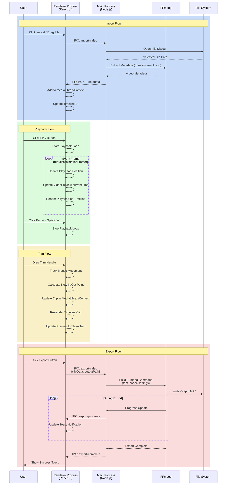

# ClipForge MVP - Product Requirements Document

## Product Overview

ClipForge is a desktop video editor built with Electron that enables creators to import, edit, and export video content. The MVP focuses on establishing the core media pipeline: import → preview → basic editing → export.

**MVP Deadline:** Tuesday, October 28th, 2025 at 10:59 PM CT

## MVP Success Criteria

The MVP is considered complete when:
- A packaged desktop application launches on macOS/Windows
- Users can import video files and see them in a timeline
- Users can preview video content in a player
- Users can perform basic trim operations on clips
- Users can export edited content to MP4 format

## Core User Stories

### 1. Application Launch & Setup

**US-001: Launch Desktop Application**
- As a video creator, I want to launch ClipForge as a native desktop application so that I can access video editing tools locally without a web browser.
- **Acceptance Criteria:**
  - App launches from system applications folder or executable
  - Application window opens with main interface
  - No console errors on startup
  - Launch time < 5 seconds

### 2. Video Import

**US-002: Import Video via File Picker**
- As a user, I want to select video files from my file system so that I can bring content into the editor.
- **Acceptance Criteria:**
  - File picker opens when clicking "Import" button
  - Supports MP4 and MOV formats
  - Selected file appears in media library/timeline
  - Shows basic file metadata (name, duration)

**US-003: Drag & Drop Video Import**
- As a user, I want to drag video files directly into the application so that I can quickly add content without navigating dialogs.
- **Acceptance Criteria:**
  - Drag area is clearly indicated
  - Dropping a valid video file imports it
  - Invalid files show error message
  - Multiple files can be dropped at once

### 3. Timeline View

**US-004: View Imported Clips in Timeline**
- As a user, I want to see my imported videos arranged in a timeline so that I can visualize my edit sequence.
- **Acceptance Criteria:**
  - Timeline displays horizontally with time markers
  - Each clip shows as a visual block
  - Clip duration is proportional to its length
  - Clips display thumbnail or name
  - Empty state shows helpful instructions

**US-005: Timeline Playhead Navigation**
- As a user, I want to see and move a playhead indicator so that I can navigate to specific moments in my edit.
- **Acceptance Criteria:**
  - Vertical playhead line visible on timeline
  - Playhead position updates during playback
  - User can click timeline to jump playhead
  - Current time is displayed

### 4. Video Preview & Playback

**US-006: Preview Video Content**
- As a user, I want to watch my video clips in a preview window so that I can see the current frame at the playhead position.
- **Acceptance Criteria:**
  - Preview window displays video at playhead position
  - Preview updates when playhead moves
  - Video renders at reasonable quality
  - Preview window has defined dimensions

**US-007: Play/Pause Video**
- As a user, I want to play and pause the timeline so that I can watch my edit in real-time.
- **Acceptance Criteria:**
  - Play button starts playback from current playhead
  - Pause button stops playback
  - Playhead advances during playback
  - Audio plays synchronized with video
  - Spacebar keyboard shortcut works

### 5. Basic Editing - Trim

**US-008: Trim Clip Start/End Points**
- As a user, I want to adjust the start and end points of a clip so that I can remove unwanted portions.
- **Acceptance Criteria:**
  - User can select a clip on timeline
  - UI shows trim handles on clip edges
  - Dragging handles adjusts in/out points
  - Preview reflects trimmed result
  - Clip duration updates accordingly

### 6. Video Export

**US-009: Export Timeline to MP4**
- As a user, I want to export my edited timeline as an MP4 file so that I can share or use the final video.
- **Acceptance Criteria:**
  - Export button is accessible
  - File picker allows choosing save location
  - Export processes the timeline composition
  - Progress indicator shows during export
  - Success notification when complete
  - Exported file plays in external video players
  - Export maintains reasonable quality

**US-010: Export with Resolution Options**
- As a user, I want to choose output resolution so that I can optimize for file size or quality.
- **Acceptance Criteria:**
  - Export dialog shows resolution dropdown
  - Options include: Source, 1080p, 720p
  - Selected resolution applies to export
  - Output video matches selected resolution

## Architecture Overview

### High-Level System Design

```
┌─────────────────────────────────────────────────────────┐
│                    Electron App                          │
│                                                           │
│  ┌─────────────────────────────────────────────────┐   │
│  │           Main Process (Node.js)                 │   │
│  │                                                   │   │
│  │  - Window Management                             │   │
│  │  - IPC Communication                             │   │
│  │  - File System Access                            │   │
│  │  - FFmpeg Process Management                     │   │
│  └─────────────────────────────────────────────────┘   │
│                         ↕ IPC                            │
│  ┌─────────────────────────────────────────────────┐   │
│  │        Renderer Process (Chromium)               │   │
│  │                                                   │   │
│  │  ┌──────────────────────────────────────────┐  │   │
│  │  │         React Application                 │  │   │
│  │  │                                            │  │   │
│  │  │  Components:                               │  │   │
│  │  │  - ImportManager                           │  │   │
│  │  │  - Timeline                                │  │   │
│  │  │  - VideoPreview                            │  │   │
│  │  │  - TrimEditor                              │  │   │
│  │  │  - ExportDialog                            │  │   │
│  │  │                                            │  │   │
│  │  │  State Management:                         │  │   │
│  │  │  - Media Library (clips array)             │  │   │
│  │  │  - Timeline State (sequence, playhead)     │  │   │
│  │  │  - Player State (playing, currentTime)     │  │   │
│  │  └──────────────────────────────────────────┘  │   │
│  └─────────────────────────────────────────────────┘   │
└─────────────────────────────────────────────────────────┘

                            ↓
                    
                     FFmpeg Binary
                  (Video Processing)
```

### Component Breakdown

#### Main Process Responsibilities
- **Window Management**: Create and manage application window
- **File System**: Handle video file imports and exports
- **IPC Handlers**: Receive requests from renderer (import, export, etc.)
- **FFmpeg Integration**: Spawn FFmpeg processes for video encoding/export
- **Security**: Manage context isolation and preload scripts

#### Renderer Process Responsibilities
- **UI Rendering**: Display all visual components
- **User Interaction**: Handle clicks, drags, keyboard input
- **Video Playback**: Control HTML5 video element for preview
- **Timeline Logic**: Manage clip arrangement and trim operations
- **State Management**: Track application state (clips, timeline, playback)

### Data Flow Diagram



### Data Flow Details

1. **Import Flow**
   - User triggers import (file picker or drag-drop)
   - Renderer sends IPC message to main process
   - Main process reads file metadata using FFmpeg
   - File path and metadata sent back to renderer
   - Renderer adds clip to MediaLibraryContext
   - Timeline updates to display new clip

2. **Playback Flow**
   - User clicks play button
   - Timeline component starts playback loop (requestAnimationFrame)
   - On each frame, update playhead position
   - VideoPreview component receives playhead position
   - Video element seeks to corresponding time
   - Audio plays from video element

3. **Trim Flow**
   - User drags trim handle on clip edge
   - Mouse movement tracked in Timeline component
   - Calculate new in/out points based on drag position
   - Update clip data in MediaLibraryContext
   - Timeline re-renders with new clip length
   - Preview updates to reflect trimmed content

4. **Export Flow**
   - User clicks export and selects save location
   - Renderer sends export request via IPC with timeline data
   - Main process constructs FFmpeg command (trim, codec settings)
   - FFmpeg processes video (trim, encode to H.264)
   - Main process sends progress updates to renderer
   - Renderer displays progress toast
   - On completion, main process notifies renderer
   - Success toast shown to user

## Technology Stack

### Desktop Framework
- **Electron**: Cross-platform desktop app framework
  - Version: Latest stable (26.x or newer)
  - Main + Renderer process architecture
  - Context isolation enabled for security

### Frontend
- **React**: UI component library
- **TypeScript** (optional): Type safety for faster development
- **CSS/Tailwind**: Styling
- **HTML5 Video Element**: Native video preview

### Video Processing
- **FFmpeg**: Industry-standard media processing
  - Pre-bundled binary (via @ffmpeg-installer/ffmpeg)
  - Called via fluent-ffmpeg Node wrapper
  - Used for: metadata extraction, trimming, exporting

### State Management
- **React Context or Zustand**: Lightweight state management
- Local state for component-specific data

### Build & Package
- **electron-builder**: Package app for distribution
- Target platforms: macOS (dmg), Windows (exe)

## MVP Technical Scope

### In Scope
- Single video track timeline
- One clip at a time on timeline (for MVP simplicity)
- Basic trim using handles or in/out points
- MP4 export only
- Minimal UI with essential controls
- File picker import
- Drag-and-drop import
- Basic error handling

### Out of Scope (Post-MVP)
- Screen/webcam recording
- Multiple tracks or picture-in-picture
- Transitions or effects
- Text overlays
- Audio manipulation
- Undo/redo
- Project saving/loading
- Advanced timeline features (split, snap-to-grid)
- Multiple simultaneous clips
- Cloud upload

## Non-Functional Requirements

### Performance
- App launches in < 5 seconds
- Timeline remains responsive with up to 5 clips
- Preview playback at 30 fps minimum
- Export completes without crashes

### Compatibility
- macOS 10.14+ (Mojave and newer)
- Windows 10/11
- Support MP4 and MOV input formats
- Output: MP4 with H.264 codec

### Reliability
- No crashes during normal operation
- Graceful error messages for invalid files
- Export process doesn't hang

## Development Milestones

### Phase 1: Foundation (Hours 0-8)
- Set up Electron + React project
- Create basic window and UI layout
- Implement IPC communication structure
- Display placeholder components

### Phase 2: Import & Preview (Hours 8-16)
- File picker video import
- Display imported clip metadata
- HTML5 video preview with basic controls
- Simple timeline visualization

### Phase 3: Timeline & Trim (Hours 16-24)
- Timeline with playhead
- Clip representation on timeline
- Trim handles or in/out points
- Playhead scrubbing

### Phase 4: Export (Hours 24-30)
- FFmpeg integration
- Export single trimmed clip to MP4
- Progress indicator
- File save dialog

### Phase 5: Polish & Package (Hours 30-36)
- Bug fixes and edge case handling
- Basic error handling
- Package as distributable
- Final testing

## Testing Strategy

### Manual Testing Checklist
- [ ] Import MP4 file via file picker
- [ ] Import MOV file via drag-and-drop
- [ ] View clip in timeline
- [ ] Play video preview
- [ ] Pause video preview
- [ ] Trim clip from start
- [ ] Trim clip from end
- [ ] Export trimmed clip to MP4
- [ ] Verify exported video plays externally
- [ ] Launch packaged app (not dev mode)

### Edge Cases
- Import invalid file type (should show error)
- Import corrupted video file
- Export with no clips on timeline
- Extremely long video file (>1 hour)
- Very short video file (<1 second)

## Success Metrics

The MVP is successful if:
1. All user stories have acceptance criteria met
2. Manual testing checklist passes
3. Packaged app launches on target OS
4. Demo video can be recorded showing full workflow
5. Submission made before Tuesday 10:59 PM CT deadline

## Risk Mitigation

### High-Risk Areas
1. **FFmpeg Integration**: Complex and varies by OS
   - Mitigation: Use pre-built binaries, test early
   
2. **Video Performance**: Large files can cause lag
   - Mitigation: Limit MVP to smaller test files, optimize later
   
3. **Packaging**: Electron apps can have build issues
   - Mitigation: Test packaging early, allow time for debugging

4. **Timeline UI Complexity**: Custom timeline components are hard
   - Mitigation: Use simple DOM-based approach for MVP, no canvas

## Confirmed Architectural Decisions

1. **Development Platform**: Windows
   - Primary build target: Windows executable
   - Secondary: macOS (if time permits)

2. **Timeline Implementation**: DOM-based
   - Use flexbox/grid layout with div elements
   - Simpler to implement, adequate for MVP
   - Canvas-based deferred to post-MVP

3. **Trim UI**: Draggable handles on clip edges
   - Handles appear on left/right edges of clips
   - Drag to adjust in/out points
   - Visual feedback during drag

4. **State Management**: React Context
   - MediaLibraryContext for clips
   - TimelineContext for sequence/playhead
   - PlayerContext for playback state

5. **File Management**: Reference original file paths
   - Don't copy files, store paths only
   - Faster import, less disk usage
   - Warning if file moves/deletes

6. **Export Settings**: Quick export with defaults
   - No export dialog for MVP
   - Default: Source resolution or 1080p
   - H.264 codec, AAC audio

7. **Error Handling**: Toast notifications + console logs
   - User-facing: Toast messages (react-hot-toast or similar)
   - Debug: Console.log/error for developers
   - No modal dialogs for MVP

8. **Minimum Video Duration**: 1 second

## Appendix: File Structure

```
clipforge/
├── package.json
├── electron.js (main process)
├── preload.js (context bridge)
├── src/
│   ├── App.jsx (main React component)
│   ├── components/
│   │   ├── ImportButton.jsx
│   │   ├── Timeline.jsx
│   │   ├── VideoPreview.jsx
│   │   ├── TrimEditor.jsx
│   │   └── ExportDialog.jsx
│   ├── hooks/
│   │   └── useMediaLibrary.js
│   └── utils/
│       ├── ffmpeg.js
│       └── timelineUtils.js
├── public/
│   └── index.html
└── dist/ (built files)
```